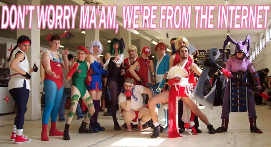
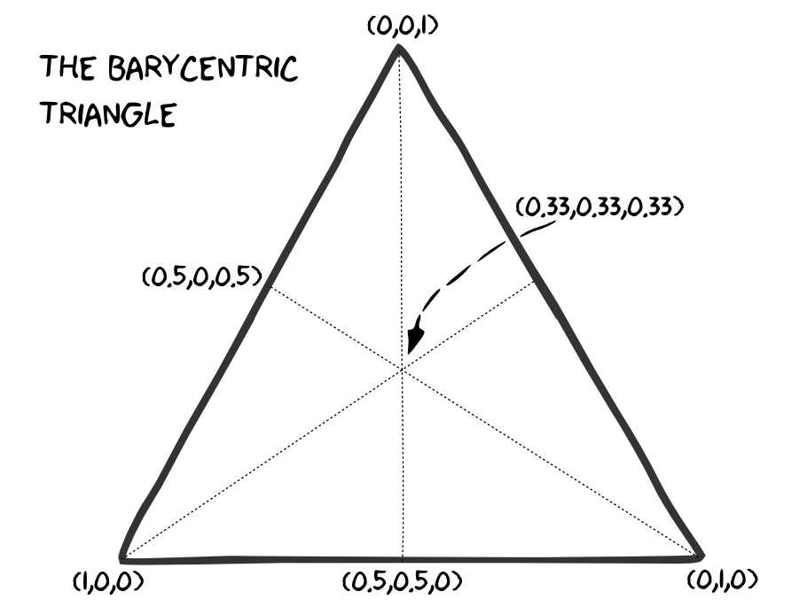
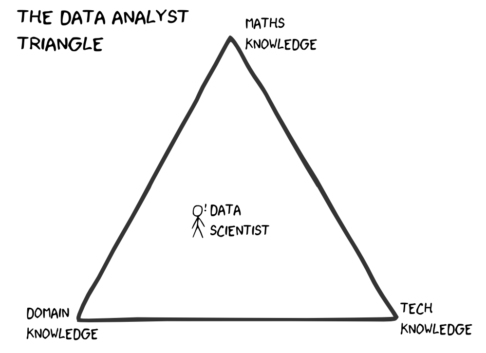

## Christoph Safferling

- since 2012: Head of Game Analytics at Blue Byte
- PhD in economics: [Three Essays on the Economics of Online Games]
  (http://kops.uni-konstanz.de/handle/123456789/17259?locale-attribute=en)
- research specialties: personnel economics, incentive theory, industrial organisation
- academic papers available at [repec.org](https://ideas.repec.org/f/psa961.html)
- contact:
  - mail: christoph.safferling@ubisoft.com
  - LinkedIn: https://www.linkedin.com/in/safferling 
  - Twitter: [@safferli](https://twitter.com/safferli) 
  - Github: [@safferli](https://github.com/safferli)
  - this talk: https://github.com/safferli/introduction_gameanalytics
  

--- &vertical

## Live Operation Games

- large online component
- not only f2p games: hybrid and all (future) AAA games
- continuous updating and balancing of the game
- need for data

***

***

### Free to Play 

> freemium: the '-mium' is Latin for 'not really'

Southpark, [Season 18, Episode 6](http://southpark.cc.com/full-episodes/s18e06-freemium-isnt-free)

***

- f2p is a *business model*, not a game type
- time vs money: opens game to a larger audience
- gives customers more impact on gameplay
- *Extra Credits* on 
  - Microtransactions https://www.youtube.com/watch?v=WXA559KNopI&hd=1
  - Doing Free to Play Wrong https://www.youtube.com/watch?v=Mhz9OXy86a0&hd=1

--- &vertical

## But... I'm creative! I don't need data! 

<!-- if you want to be an Indie developer, make your first games on someone else's budget. You don't want to make all those early mistakes on your own budget! -->

<!-- being an indie doesn't mean you can do what you want -- investor wants something, banks want something, unless you have your own money and you're willing to spend that -->

***

***

### Why will you want data? 

- market estimation/business case
  - *"even if you are prepared to wait for two and a half years to see the money come in, 69% of indie games are going to lose money"* -- [Cliff Harris](http://positech.co.uk/cliffsblog/2016/01/06/random-but-fun-indie-game-data-sampling/)
  - no business case, no money
- game design 
  - confirm your expectations/calculations
  - what do your players actually like?
  - progression is one of the key GD principles... it's tricky and hard work! 

<!-- you're studying here, which is the most expensive thing you will be doing (short of having kids, which will also study)... so you want this to pay off, right? -->

***

### Getting data

<!-- - mods!
  - steam workshop
  - Paradox, Cities Skylines finding most-desired features from modders
-->

<!-- like Steam store data, mod -->
- internal vs. external data
- [Google analytics](http://www.google.com/analytics/#?modal_active=none) (web, and many external pages) 
- Steam [Stats and Achievements](https://partner.steamgames.com/documentation/ugs)
- mobile analytics (e.g. [Flurry/Yahoo](https://developer.yahoo.com/), [Tune/HasOffers](http://www.hasoffers.com/))

***

### if you can only track few data points

- sales data (obviously!)
- progress meter (e.g. playerlevel, mainquest completion)
- playtime (of different modes)

--- &vertical

## Data Scientists

> [A data scientist is] a high-ranking professional with the training and 
> curiosity to make discoveries in the world of big data.

Data Scientist: the sexiest job of the 21st century, 
[Harvard Business Review, Oct 2012]
(https://hbr.org/2012/10/data-scientist-the-sexiest-job-of-the-21st-century/)

***

***

***

### Skills sought after

- domain knowledge and experience
- *"mitdenken"*: think and act independently, and ahead
- statistics and mathematics
- Linux and scripting, mostly R and Python
- database (SQL and NoSQL, Hadoop) knowledge
- communication and presentation skills

<!-- you specifically do *not* need Excel! -->

***

--- &vertical

## Game Analytics

- provide data, data support, and insights to all
  - managers
  - game designers
  - marketing
  - CRM/support
  - LiveOps team (including programmers)
- educate on data and data usage

***

### fancy shit!

- Shiny R: [ACID mission dashboard](http://127.0.0.1:7471/)
- Survival analysis: [Anno 2205 event sessions](http://127.0.0.1:4076/)

<!-- Anno 2205 endgame 	Provides data on endgame (after completing main quest 29). -->
<!-- Anno 2205 event sessions 	Provides data on event sessions in Anno 2205. -->
<!-- Anno 2205 quests 	Provides data on quests in Anno 2205. -->
<!-- Anno 2205 settings 	Provides data on game and language settings in Anno 2205. -->
<!-- Anno 2205 online features 	Provides data on online feature usage in Anno 2205. -->
<!-- Anno 2205 population and economy 	Provides data on populations and economies of corporations -->

---

## Conclusion

- modern games rely on data for game design (and monetisation)
- game analytics provides these data (with interpretations)
- cross-section of all game development departments

---

## ...questions?

---

## Thank you

<!-- &hellip;and we're hiring! &#9786; 
 &#128522; &#128512; -->

